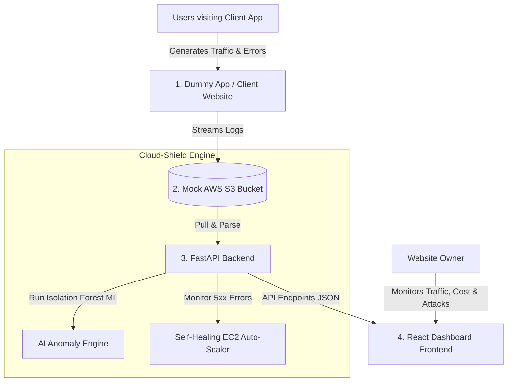

# Cloud-Shield AI 🛡️✈️
> **Autonomous SaaS Observability, FinOps, & Self-Healing Engine**

Cloud-Shield AI is an intelligent, automated cloud observability system. This repository is structured as a full-stack **SaaS Observability Platform** that intercepts, monitors, and recovers client applications in real time using mock AWS services (`boto3` + `moto`), machine learning, a FastAPI backend, and a premium **React Dashboard** hosted on Vercel.

---

## 🏗️ SaaS Architecture



---

## 📂 Project Directory Structure

The project is divided into Backend, React Frontend, and Dummy Client Application modules:

```text
cloud-shield-ai/
├── README.md               # Architecture documentation and roadmap
├── requirements.txt         # Backend Python dependencies (FastAPI, boto3, moto, scikit-learn)
│
├── backend/
│   ├── app.py              # FastAPI server (Log parser, AWS simulator, Anomaly ML, and REST API)
│   └── server.log          # Raw log buffer synced to mock S3
│
├── frontend/               # React Dashboard (Vite + React + Tailwind)
│   ├── package.json        # Node.js metadata & dependencies (react, recharts, tailwindcss)
│   ├── vite.config.js      # Vite build config
│   ├── tailwind.config.js  # Tailwind CSS utility definitions
│   ├── src/
│   │   ├── main.jsx        # React entrypoint
│   │   ├── App.jsx         # Main Dashboard (Charts, alerts, real-time fetching logic)
│   │   ├── index.css       # Tailwind & custom glassmorphism styles
│   │   └── components/     # Stats cards, logs widgets, instances visualizers
│   └── public/
│
└── dummy_app/
    ├── app.py              # Mock customer website (simple Flask/FastAPI app)
    └── templates/
        └── index.html      # Interactive UI simulating user behavior (clicks, brute force, 500 errors)
```

---

## ⚙️ Component Details

### 1. `backend/` (FastAPI Server)
Acts as the central control plane:
*   **Virtual AWS Environment:** Initializes local mock S3 (`cloud-shield-logs-bucket`) and mock EC2 services.
*   **Log Ingestion:** Reads log entries uploaded by the client apps.
*   **AI Anomaly Engine:** Runs `Isolation Forest` unsupervised machine learning to detect data transfer outliers (cost leaks).
*   **Self-Healing Controller:** Tracks consecutive `5xx` errors. If consecutive crashes exceed 5, it triggers a mock EC2 launch (`run_instances`) and returns the scaled instance status.
*   **API Endpoints:** Exposes:
    *   `GET /api/stats` - Returns counts of status codes, active users, and data transfer sizes.
    *   `GET /api/security` - Returns IPs flagged for suspicious activities (e.g., brute-force login attempts).
    *   `GET /api/anomalies` - Returns IPs flagged by the AI for high bandwidth cost leaks.
    *   `GET /api/healing` - Returns active self-healing states and scaled EC2 instance statuses.

### 2. `frontend/` (React Dashboard)
A premium dashboard built using **React** and **Tailwind CSS**:
*   **Modern Dark UI:** Soft glassmorphism, responsive grids, and alerts designed with glowing red alerts.
*   **Interactive Visualizations:** Leverages **Recharts** (React charts library) to display live pie charts of traffic and bar charts of HTTP status codes.
*   **Real-time API Polling:** Dynamic state updates via React hooks (`useState`, `useEffect`) fetching data directly from the FastAPI server.
*   **Self-Healing Visualizer:** Displays live mock EC2 scaling instances and status logs.

### 3. `dummy_app/` (Target Customer Website)
A simple interactive page simulating a client website:
*   **Simulate Normal Clicks:** Buttons to view products or contact pages to generate status `200` logs.
*   **Simulate Brute Force Attack:** A button to generate continuous failed login attempts (status `401`) from a specific IP.
*   **Simulate Server Crash:** A button to trigger internal server errors (status `500`).
*   **Simulate Data Leak (High Bandwidth):** A button simulating massive file downloads (>50MB) to trigger the FinOps anomaly alerts.

---

## 🚀 Setup & Execution (For Developers)

### 1. Backend Setup
Install Python dependencies and start the API:
```bash
# Install dependencies
pip install fastapi uvicorn pandas matplotlib boto3 moto scikit-learn jinja2

# Run Backend
cd backend
uvicorn app:app --port 8000 --reload
```

### 2. Frontend (React) Setup
Install Node dependencies and run the Vite dev server:
```bash
cd frontend

# Install package.json dependencies
npm install

# Start Vite live reload development server
npm run dev
```

### 3. Dummy Client App Setup
Run the mock website:
```bash
cd dummy_app
python app.py --port 5000
```

---

## 🗺️ Next Steps & Roadmap (Tasks for Collaboration)

- [ ] **Task 1: Set up folder structure** - Move existing mock S3 setup into `backend/app.py`.
- [ ] **Task 2: Initialize React App** - Create `frontend/` folder, initialize Vite React app, and install packages (`lucide-react`, `recharts`, `tailwindcss`).
- [ ] **Task 3: Implement `dummy_app/`** - Create a script that generates active log lines into `server.log` (or pushes directly to backend S3 API).
- [ ] **Task 4: Integrate Isolation Forest** - Write the AI detector inside the backend API to identify cost-leak IPs.
- [ ] **Task 5: React Dashboard Integration** - Hook up React components to fetch data from the FastAPI endpoints in real time.
- [ ] **Task 6: Self-Healing Trigger** - Add EC2 auto-scaling simulation if consecutive 500 errors are detected.
