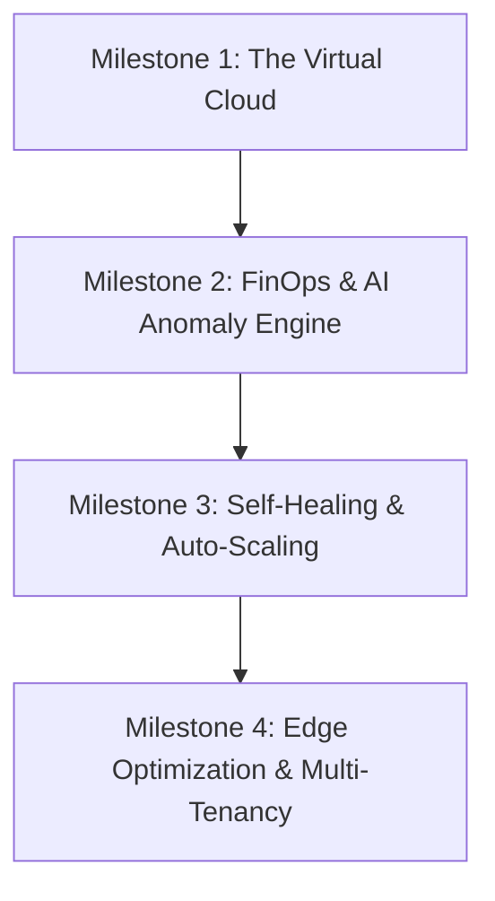

# Cloud-Shield AI 🛡️✈️
> **Autonomous Cloud FinOps & Self-Healing Observation Engine**

Cloud-Shield AI is an intelligent, automated cloud observability system. Rather than just reporting errors and cost spikes, Cloud-Shield AI takes real-time actions to protect servers from crashing (Self-Healing) and prevents unexpected cloud bills (Active FinOps Cost Control).

---

## 🎯 The Vision
Modern cloud observability tools are passive—they send alerts and expect humans to fix them. **Cloud-Shield AI** shifts from passive reporting to **Active Defense + Auto-Recovery**.

1. **FinOps Cost Leak Protection:** Machine Learning (Isolation Forest) flags abnormal data transfer and cost spikes.
2. **Self-Healing Infrastructure:** Automatically scales or spins up recovery instances when consecutive server crashes (5xx errors) are detected.
3. **Local Cloud Mocking:** The entire AWS environment (S3, EC2, CloudFront) is simulated locally using `moto` and `boto3`, meaning zero AWS bill and offline execution.

---

## 🗺️ The 4-Milestone Roadmap



### 🔹 Milestone 1: The Virtual Cloud (Simulating AWS S3)
*   **Goal:** Simulate a real AWS cloud environment locally without real accounts or credit cards.
*   **Implementation:**
    *   Initialize a mock AWS S3 environment using the `moto` mocking library.
    *   Upload `server.log` to a virtual S3 bucket (`cloud-shield-logs-bucket`).
    *   Programmatically retrieve and parse the logs from S3 instead of a local file path.

### 🔹 Milestone 2: AI Anomaly & Cost Leak Detection
*   **Goal:** Use Unsupervised Machine Learning to detect abnormal traffic patterns.
*   **Implementation:**
    *   Train a Scikit-Learn `Isolation Forest` model on logs (Size/Bytes, Status).
    *   Identify cost leak anomalies (e.g., IPs transferring massive data (>50MB) repeatedly).
    *   Generate active alerts to prevent cost overruns.

### 🔹 Milestone 3: Self-Healing & Auto-Recovery
*   **Goal:** Make the application self-heal in real-time when it detects a server crash.
*   **Implementation:**
    *   Monitor parsed log streams for consecutive HTTP status codes like `500` or `503`.
    *   If consecutive crashes exceed 5, trigger a simulated EC2 Auto-Scaling event (via `boto3` + `moto`).
    *   Launch a new mock EC2 instance to distribute the load and print the new Instance ID.

### 🔹 Milestone 4: Edge Optimization & Multi-Tenancy
*   **Goal:** Scale the solution into a SaaS-ready business model.
*   **Implementation:**
    *   Implement Client-ID filters to support multi-tenancy (separating Company A and Company B logs).
    *   Analyze URL request frequencies and output suggestions in a mock `edge_rules.json` file.
    *   Recommend edge caching rules (like AWS CloudFront) for high-traffic paths to save origin server costs.

---

## 🛠️ Project Setup & Installation

1. **Clone the repository:**
   ```bash
   git clone https://github.com/sahilgodage05-debug/cloud-shield-ai.git
   cd cloud-shield-ai
   ```

2. **Install dependencies:**
   ```bash
   pip install -r requirements.txt
   ```

3. **Run the observation engine:**
   ```bash
   python main.py
   ```
